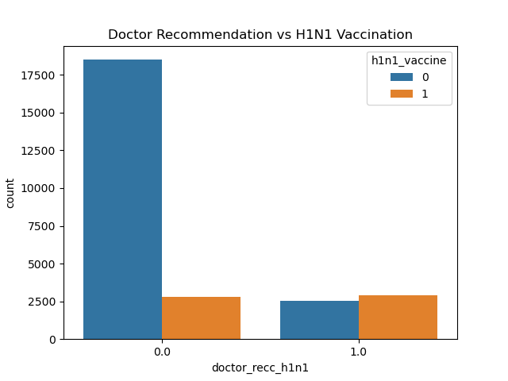
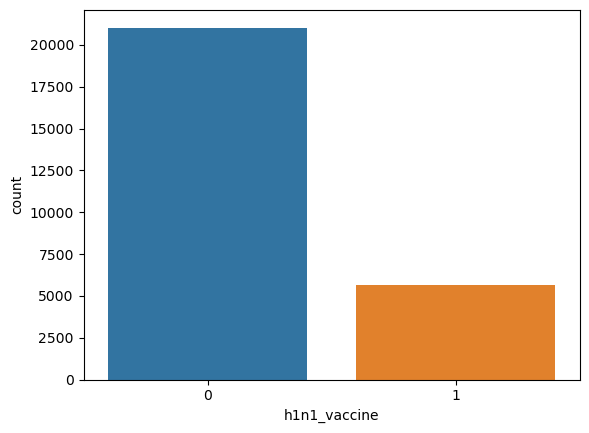
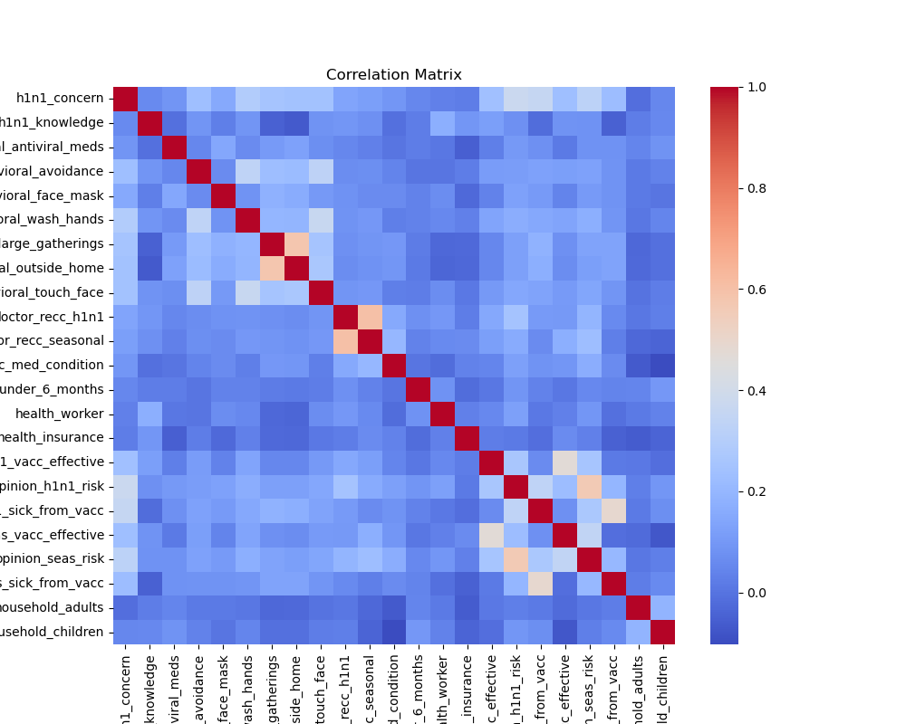
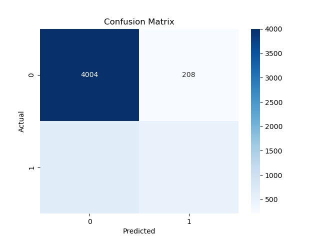
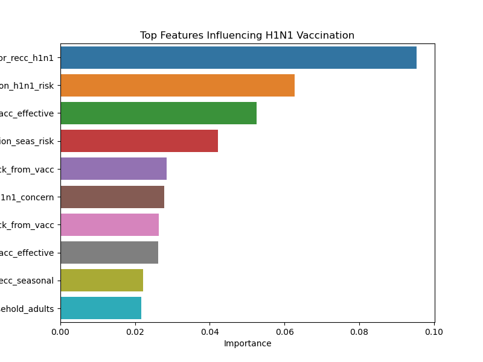

# h1n1-flu-vaccine-prediction
Predicting H1N1 flu vaccine uptake using machine learning

## Project Overview

During the 2009 H1N1 influenza pandemic, public health organizations worked to increase vaccination rates to reduce the spread of the virus. However, not all individuals chose to receive the vaccine. Understanding the factors that influence vaccination decisions is essential for improving public health communication and vaccination campaigns.

This project uses machine learning classification models to predict whether an individual received the H1N1 flu vaccine based on demographic characteristics, health conditions, behaviors, and attitudes toward vaccines.

By identifying key predictors of vaccination behavior, this analysis provides insights that may help public health organizations design more effective outreach strategies and improve vaccine uptake.

## Business Understanding

#### Stakeholder

The primary stakeholders for this project include:

- Public health organizations

- Healthcare policymakers

- Medical professionals involved in vaccination campaigns

These stakeholders aim to increase vaccination rates in order to reduce the spread of infectious diseases and protect vulnerable populations.

## Business Problem

During the 2009 H1N1 pandemic, vaccination uptake varied significantly across the population. Public health agencies need to understand what factors influence people's vaccination decisions in order to design more effective vaccination campaigns.

This project aims to answer the following question:

- Can we predict whether an individual will receive the H1N1 vaccine based on demographic characteristics, health behaviors, and attitudes toward vaccines?

### Project Objectives

The objectives of this project are to:

Explore factors influencing vaccination decisions

Build machine learning models to predict H1N1 vaccination

Compare model performance

Provide insights to support public health decision-making

Project Workflow

The project follows a standard machine learning workflow:

Business Understanding

Data Understanding

Exploratory Data Analysis (EDA)

Data Preparation

Feature Engineering and Encoding

Train/Test Split

Model Training

Model Evaluation

Model Comparison

Insights and Recommendations

## Data Understanding

The dataset used in this project comes from the National 2009 H1N1 Flu Survey, which collected information about individuals’ health behaviors, demographic characteristics, and attitudes toward influenza vaccination.

The dataset contains information related to:

- Concern about H1N1

- Knowledge about the virus

- Preventive health behaviors

- Doctor recommendations

- Demographic characteristics

- Vaccine attitudes and risk perceptions

Each record represents a single survey respondent.

### Dataset Files

The project uses two main datasets:

#### 1. training_set_features.csv

Contains predictor variables such as:

- Demographic information

- Health behaviors

- Vaccine attitudes

#### 2. training_set_labels.csv

Contains target variables indicating whether the respondent received:

H1N1 vaccine

Seasonal flu vaccine

The datasets are merged using the respondent_id variable.

## Exploratory Data Analysis

Exploratory Data Analysis (EDA) was conducted to understand the structure of the dataset and identify patterns that influence vaccination behavior.

## Key observations include:

- Most respondents did not receive the H1N1 vaccine, indicating class imbalance.

- Doctor recommendation strongly correlates with vaccination behavior.

- Individuals with higher concern about H1N1 are more likely to vaccinate.

- Healthcare workers tend to have higher vaccination rates.

- Age group influences vaccination uptake.

- Visualizations used in the analysis include:

- Target variable distribution

- Vaccine attitude distributions

- Age group comparisons

- Correlation heatmaps

## Data Preparation

Several preprocessing steps were performed before training machine learning models.

- Handling Missing Values

Missing values were filled using the mode, which preserves the most common category for categorical variables.

- Removing Unnecessary Columns

The following columns were removed:

respondent_id – a unique identifier with no predictive value

seasonal_vaccine – removed to prevent data leakage

Including seasonal vaccination data could artificially inflate model performance because individuals who receive one vaccine are more likely to receive the other.

- Encoding Categorical Variables

Many variables in the dataset are categorical (for example age group, race, and employment status).

One-Hot Encoding was used to convert these categorical variables into numerical features suitable for machine learning models.

This method creates binary columns for each category while preventing the model from assuming an incorrect numerical relationship between categories.

- Train/Test Split

The dataset was split into:

80% training data

20% testing data

This allows the models to be evaluated on unseen data and helps measure how well they generalize.

- Feature Scaling

Feature scaling using StandardScaler was applied before training the Logistic Regression model.

Scaling ensures that all variables contribute equally to the model and prevents variables with larger numeric ranges from dominating the learning process.

- Modeling

Three classification models were developed and evaluated.

- Logistic Regression

A baseline model that provides stable performance and strong interpretability.

- Decision Tree

A non-linear model capable of capturing complex relationships between variables.

- Random Forest

An ensemble learning method that combines multiple decision trees to reduce overfitting and improve predictive performance.

## Model Evaluation

Several evaluation metrics were used to assess model performance:

- Accuracy

- Precision

- Recall

- F1 Score

- Confusion Matrix

- ROC Curve and AUC Score

- Cross Validation

These metrics provide a more comprehensive evaluation than accuracy alone, especially because the dataset contains class imbalance.

Model Comparison
Model	Accuracy
Logistic Regression	0.84
Decision Tree	0.75
Random Forest	0.83

Logistic Regression achieved the highest accuracy and demonstrated stable performance across cross-validation folds.

Final Model Selection

Logistic Regression was selected as the final model.

Although Random Forest also performed well, Logistic Regression provided:

Strong predictive performance

High model interpretability

Stable generalization across cross-validation folds

Interpretability is particularly important for public health stakeholders who need to understand the factors influencing vaccination behavior.

## Key Insights

The analysis identified several important factors influencing vaccination behavior.

- Doctor Recommendation

Doctor recommendation was one of the strongest predictors of vaccination. Individuals advised by healthcare professionals were significantly more likely to receive the vaccine.

- Risk Perception

Respondents who believed that H1N1 posed a serious health risk were more likely to vaccinate.

- Healthcare Workers

Healthcare workers showed higher vaccination rates, likely due to greater exposure and awareness of disease risks.

- Age Group

Older individuals were more likely to receive the vaccine compared to younger populations.

## Recommendations

Based on the findings, several recommendations can be made for public health organizations.

- Encourage Doctor Recommendations

Healthcare providers should actively recommend vaccines during patient interactions.

- Improve Public Awareness

Public health campaigns should emphasize the risks of influenza to increase awareness and encourage vaccination.

- Target Low Vaccination Groups

Educational outreach programs should focus on populations with lower vaccination rates.

- Workplace Vaccination Programs

Expanding vaccination initiatives in workplaces, particularly healthcare environments, may improve vaccination uptake.

## Limitations

Several limitations should be considered when interpreting the results.

- The dataset relies on self-reported survey data, which may contain inaccuracies.

- The data reflects conditions during the 2009 H1N1 pandemic, which may differ from current vaccination behaviors.

- Some variables required missing value imputation, which introduces some uncertainty.

- Machine learning models identify patterns, but they do not establish causal relationships.

## Future Improvements

Future research could improve this analysis by:

- Testing additional models such as Gradient Boosting or XGBoost

- Applying more advanced feature engineering

- Incorporating recent vaccination datasets

- Including additional variables such as healthcare access or geographic information

## Conclusion

This project explored the factors that influence whether individuals received the H1N1 flu vaccine using machine learning classification models. By analyzing demographic characteristics, health behaviors, and attitudes toward vaccines, the study identified important patterns associated with vaccination decisions.

Among the models tested, Logistic Regression provided the best balance between predictive performance and interpretability, achieving the highest accuracy and stable results across cross-validation folds. The analysis revealed that doctor recommendation, perceived risk of H1N1, and occupation (particularly healthcare workers) were among the most important predictors of vaccination behavior.

These findings highlight the important role that healthcare professionals and risk awareness play in encouraging vaccination. Public health organizations can use these insights to design more effective vaccination campaigns and communication strategies aimed at increasing vaccine uptake.

Overall, this project demonstrates how machine learning can be used to support data-driven public health decision-making by identifying the factors that most strongly influence vaccination behavior.
