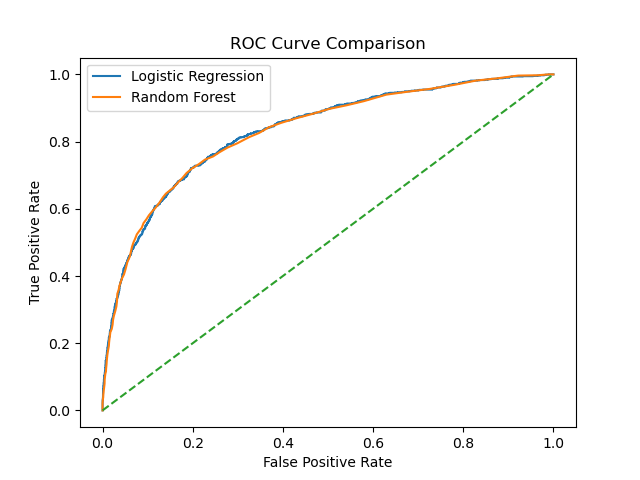

# H1N1 Flu Vaccine Prediction

Predicting H1N1 flu vaccine uptake using machine learning.

---

##  Project Overview

During the 2009 H1N1 influenza pandemic, vaccination was one of the most effective strategies used to reduce infection rates and prevent severe outcomes. Despite this, vaccination uptake varied significantly across different population groups.

This project applies machine learning techniques to predict whether an individual received the H1N1 vaccine based on:

- Demographic characteristics  
- Health conditions  
- Preventive behaviors  
- Attitudes toward vaccines  

Beyond prediction, the goal is to identify key factors influencing vaccination decisions and generate actionable insights for public health organizations.

---

##  Dataset

The dataset used in this project comes from the **National 2009 H1N1 Flu Survey**.

🔗 Dataset Source:  
https://www.drivendata.org/competitions/66/flu-shot-learning/data/

### Dataset Description

The dataset consists of two main files:

- `training_set_features.csv` → Predictor variables  
- `training_set_labels.csv` → Target variables  

Each row represents an individual respondent and includes:

- Demographics (age, sex, race, income)  
- Health conditions  
- Behavioral factors (mask use, hand washing, etc.)  
- Opinions and perceptions about vaccines  

The datasets are merged using a unique identifier: `respondent_id`.

### Target Variable

- `h1n1_vaccine`  
  - `1` → Received vaccine  
  - `0` → Did not receive vaccine  

---

# Business Problem

Public health organizations aim to increase vaccination rates to reduce the spread of infectious diseases.

However, not all individuals choose to vaccinate.

## Key Question:
> Can we predict whether someone will receive the H1N1 vaccine based on their characteristics and behaviors?

Understanding this helps:
- Improve vaccine outreach  
- Target hesitant populations  
- Design better public health campaigns  

---

##  Stakeholders

- Public health organizations  
- Healthcare policymakers  
- Medical professionals  

These stakeholders rely on data-driven insights to improve vaccination strategies and protect vulnerable populations.

---

##  Methodology

The project follows a structured data science workflow:

### 1. Data Preparation
- Merged datasets using `respondent_id`
- Handled missing values using mode imputation
- Removed irrelevant columns (e.g., `respondent_id`)
- Applied one-hot encoding to categorical variables
- Performed train-test split

---

### 2. Pipeline Implementation
A machine learning pipeline was used to:

- Apply preprocessing (scaling + encoding)
- Train models consistently
- Prevent data leakage
- Improve reproducibility

---

### 3. Reusable Evaluation Function
A reusable function was created to standardize:

- Model training  
- Predictions  
- Evaluation metrics  
- Visualization  

This improves code quality and ensures fair model comparison.

---

### 4. Models Used

- Logistic Regression  
- Decision Tree  
- Random Forest  

---

### 5. Hyperparameter Tuning

GridSearchCV was used to optimize the Decision Tree model by tuning:

- Maximum depth  
- Minimum samples per split  

This helps balance bias and variance and improve performance.

---

### 6. Model Evaluation

Models were evaluated using:

- Accuracy  
- Precision  
- Recall  
- F1-score  
- ROC-AUC  

Cross-validation was used to ensure stability and generalization.

---

##  Model Performance

| Model | Accuracy |
|------|--------|
| Logistic Regression | 0.84 |
| Decision Tree | 0.75 |
| Random Forest | 0.83 |

### Final Model:
 Logistic Regression

**Why?**
- Strong performance  
- Stable across folds  
- Easy to interpret  

---

##  Key Visualizations

### Vaccine Distribution

### Doctor Recommendation vs Vaccination

### ROC Curve

### Feature Importance

---

##  Key Insights

- Doctor recommendation is the strongest predictor of vaccination  
- Individuals with higher perceived risk are more likely to vaccinate  
- Healthcare workers show higher vaccination uptake  
- Older individuals are more likely to receive the vaccine  
- Class imbalance affects model recall  

---

##  Recommendations

Based on the findings:

- Encourage healthcare providers to actively recommend vaccines  
- Increase public awareness of vaccine risks and benefits  
- Target younger populations with tailored campaigns  
- Expand workplace vaccination programs  

---

##  Future Recommendations

- Use machine learning to identify high-risk or hesitant populations  
- Integrate vaccination reminders into healthcare systems  
- Improve accessibility and distribution infrastructure  
- Conduct continuous public health awareness campaigns  

---

##  Limitations

- Data is self-reported and may contain inaccuracies  
- Dataset reflects 2009 behavior (may not generalize today)  
- Missing values required imputation  
- Class imbalance impacts model performance  
- Models identify patterns, not causation  

---

##  Project Files

-  Notebook: `notebooks/project_notebook.ipynb`  
-  Notebook PDF: `notebooks/project_notebook.pdf`  
-  Presentation: `presentation/presentation.pdf`  

---

##  Conclusion

This project demonstrates how machine learning can be used to predict vaccination behavior and uncover key drivers such as doctor recommendation and risk perception.

These insights provide valuable guidance for public health organizations aiming to improve vaccination uptake and design more effective health interventions.

